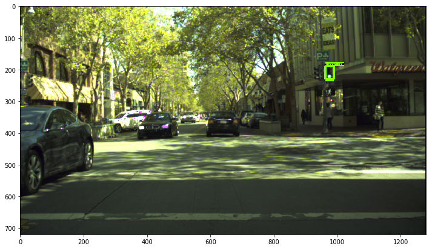
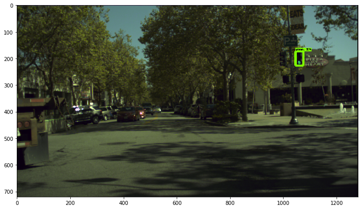

# tl_detector
See the blog: https://blog.csdn.net/AdamShan/article/details/88627733 for detail!

* samples: test images
* configs: config files uesed in the blog
* create_lisa_tf_record.py: script to produce tf record from LISA dataset
* traffic_light_detection: the inference notebook

> Note: In the blog, we trained our ssd_mobilenet_fpn on the Google Cloud TPU and trained the ssd_resnet_fpn on local GPU. You have to custom the file & output path in the config file by yourself.

## detecte result

